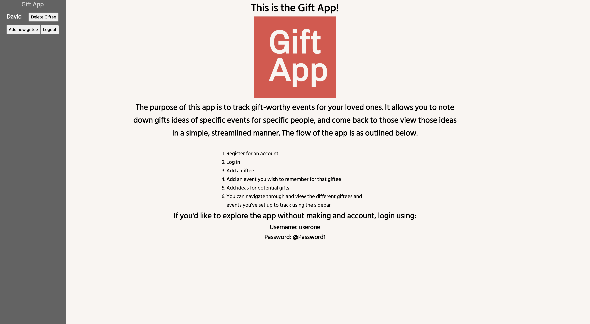
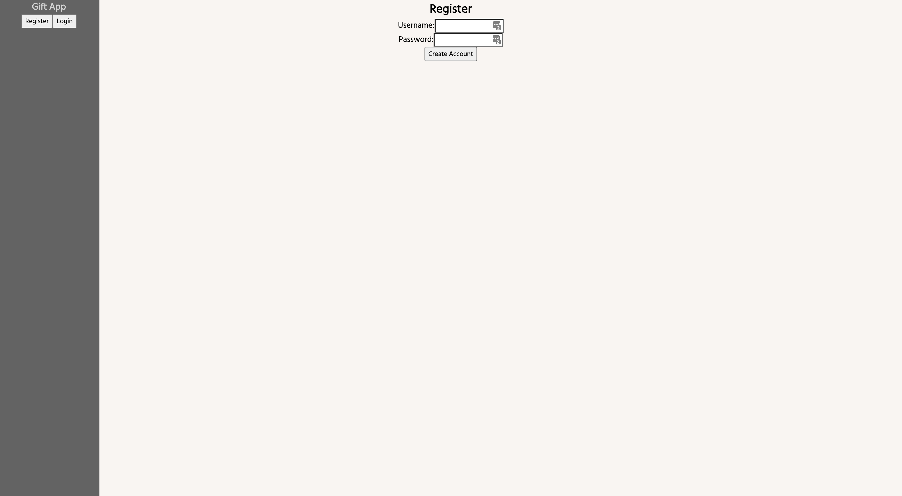
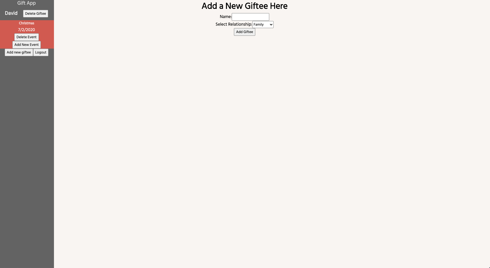
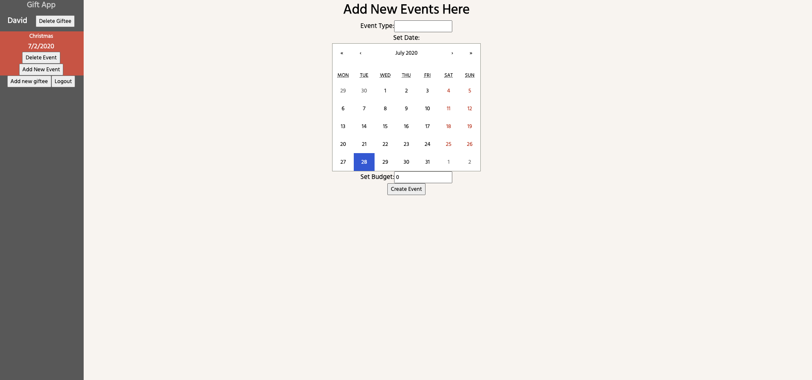
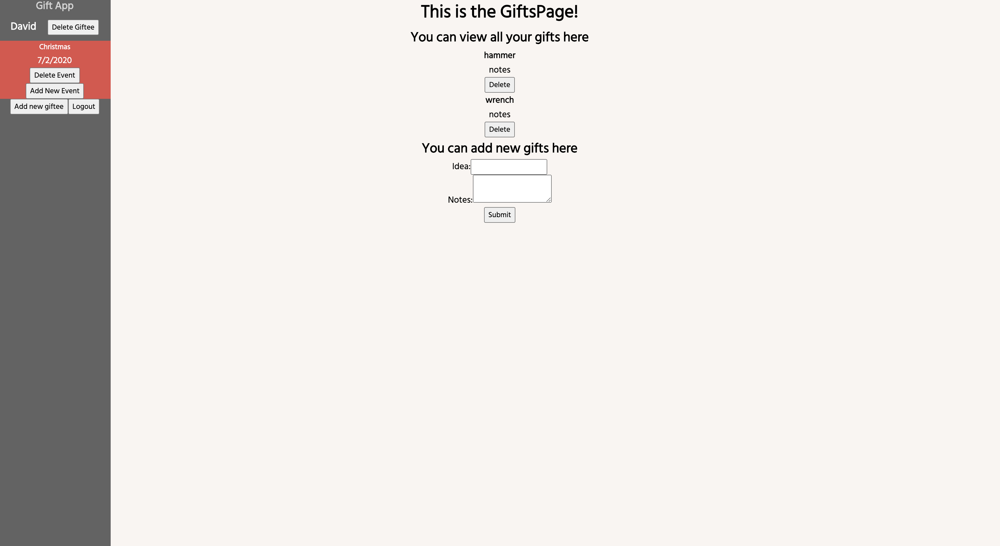

# Application
Gift App

## Built By
Kevin Jiang

## Links
live site: https://gift-app.now.sh/ 
server: https://shielded-dusk-65015.herokuapp.com 

## Using The API
Currently the API supports GET, POST, DELETE, and PATCH endpoints. 

- Unprotected Endpoints 
  + Sign Up: POST (https://url/users/register) 

- Protected Endpoints 
  + Login: POST (https://url/users/login) 
  + Get Giftees: GET (https://url/users/giftees) 
  + Create a new Giftee: POST (https://url/giftees) 
  + Get one Giftee: GET (https://url/users/giftees/:giftee_id) 
  + Delete a Giftee: DELETE (https://url/giftees/:giftee_id) 
  + Get all Events associated with Giftee: GET (https://url/users/giftees/:giftee_id/events) 
  + Create a new Event: POST (https://url/events) 
  + Get one Event: GET (https://url/users/events/:event_id) 
  + Delete an Event: DELETE (https://url/event/:event_id) 
  + Get all Gifts associated with an Event: GET (https://url/users/events/:event_id/gifts) 
  + Create a new Gift: POST (https://url/gifts) 
  + Get one Gift: GET (https://url/users/gifts/:gift_id) 
  + Delete a Gift: DELETE (https://url/gifts/:gift_id) 
  + Update a Gift's notes: PATCH (https://url/gifts/:gift_id) 

## Screen Shots
 
 
 
 
 
 

### Summary
This app allows you to track significant dates for the people you care about.
Create Giftees, gift-worthy events for those Giftees, and track gift ideas to make those events memorable.

## Technologies
- Font End
  * React
- Back End
  * Node.js
  * Express
  * Postgresql
- Testing
  * Mocha, Chai
  * Jest